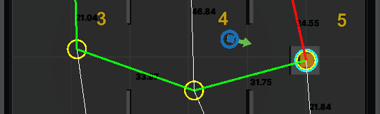

# Solving Shortest Path Problems in Video Game Environments Using Reinforcement Learning

**Features**

- Train RL models to solve Single-Source Shortest Path Problems
- Use the Dijkstra algorithm to validate the optimal path

**Training Table**

  Training Models, Phases and Naming :
  
  | **Training Type** | **Simple** | **Advanced** |
  |:-----------------:|:----------:|:------------:|
  | **Phase A**| **SA** | **AA** |
  | **Phase B**| **SB** | **AB** |
  | **Phase C**| **SC** | **AC** |
  | **Phase D**| **SD** | **AD** |

# Installation and Set Up

  See the [Getting Started Guide](GettingStartedGuide.md) for more detailed informations about installation and setting up the project.
  
# Training with Mlagents

  See the [Project Overview](ProjectOverview.md) for more detailed informations about installation and setting up and executing the project.
  

# This Project is using the Unity ML Agent Toolkit

**The Unity Machine Learning Agents Toolkit** (ML-Agents) is an open-source
project that enables games and simulations to serve as environments for
training intelligent agents. We provide implementations (based on PyTorch)
of state-of-the-art algorithms to enable game developers and hobbyists to easily
train intelligent agents for 2D, 3D and VR/AR games. Researchers can also use the
provided simple-to-use Python API to train Agents using reinforcement learning,
imitation learning, neuroevolution, or any other methods. These trained agents can be
used for multiple purposes, including controlling NPC behavior (in a variety of
settings such as multi-agent and adversarial), automated testing of game builds
and evaluating different game design decisions pre-release. The ML-Agents
Toolkit is mutually beneficial for both game developers and AI researchers as it
provides a central platform where advances in AI can be evaluated on Unity’s
rich environments and then made accessible to the wider research and game
developer communities.

**Reference :** 
Juliani, A., Berges, V., Teng, E., Cohen, A., Harper, J., Elion, C., Goy, C.,
Gao, Y., Henry, H., Mattar, M., Lange, D. (2020). Unity: A General Platform for
Intelligent Agents. _arXiv preprint
[arXiv:1809.02627](https://arxiv.org/abs/1809.02627)._
https://github.com/Unity-Technologies/ml-agents.

## License

[Apache License 2.0](LICENSE.md)
