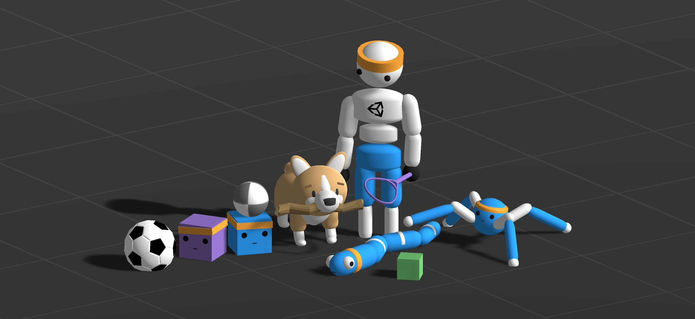

# Using RL To Solve Single-Source Shortest Path Problems In Game Environment

About the thesis project...

**Features**

- Solves sssp in video games
- Use Dijkstra algorithm to validate the distance

** Training Table **
  
  | **Training Type** | **Simple** | **Advanced** |
  |:-----------------:|:----------:|:------------:|
  | **Phase A**| ** as** || **aa ** |
  | **Phase B**|| **bs ** || **ab ** |
  | **Phase C**|| **cs ** || **ac ** |
  | **Phase D**|| **ds ** || **ad ** |
  
  documentation that corresponds to the release version you're using.
- The `com.unity.ml-agents` package is [verified](https://docs.unity3d.com/2020.1/Documentation/Manual/pack-safe.html)
  for Unity 2020.1 and later. Verified packages releases are numbered 1.0.x

# Training with mlagents-learn

To view a description of all the CLI options accepted by mlagents-learn, use the --help
```sh
mlagents-learn --help
```
The basic command for training is:
```sh
mlagents-learn <trainer-config-file> --env=<env_name> --run-id=<run-identifier>
```
1. ``<trainer-config-file>`` is the file path of the trainer configuration YAML
2. ``<env_name>``(Optional) is the name (including path) of your Unity executable containing the agents to be trained.
3. ``<run-identifier>`` is a unique name you can use to identify the results of your training runs.
4. ``initialize-from=<run-identifier> --run-id=<new-id>`` start a new training run but initialize it using an already-trained model.
5. ``--force`` to re-run a previously interrupted or completed training run and re-use the same run ID.
6. ``--resume`` to resume a previously interrupted or completed training run
Note: environment is required!

*Using an [Environment Executable](https://github.com/Unity-Technologies/ml-agents/blob/main/docs/Learning-Environment-Executable.md)


# Visualize Metrics

In order to observe the training process, either during training or afterward, start TensorBoard:
```sh
tensorboard --logdir results --port 6006
```
Open a browser window and navigate to [localhost:6006](http://localhost:6006).


# This Project is using the Unity ML Agent Toolkit

**The Unity Machine Learning Agents Toolkit** (ML-Agents) is an open-source
project that enables games and simulations to serve as environments for
training intelligent agents. We provide implementations (based on PyTorch)
of state-of-the-art algorithms to enable game developers and hobbyists to easily
train intelligent agents for 2D, 3D and VR/AR games. Researchers can also use the
provided simple-to-use Python API to train Agents using reinforcement learning,
imitation learning, neuroevolution, or any other methods. These trained agents can be
used for multiple purposes, including controlling NPC behavior (in a variety of
settings such as multi-agent and adversarial), automated testing of game builds
and evaluating different game design decisions pre-release. The ML-Agents
Toolkit is mutually beneficial for both game developers and AI researchers as it
provides a central platform where advances in AI can be evaluated on Unity’s
rich environments and then made accessible to the wider research and game
developer communities.

**Reference :** 
Juliani, A., Berges, V., Teng, E., Cohen, A., Harper, J., Elion, C., Goy, C.,
Gao, Y., Henry, H., Mattar, M., Lange, D. (2020). Unity: A General Platform for
Intelligent Agents. _arXiv preprint
[arXiv:1809.02627](https://arxiv.org/abs/1809.02627)._
https://github.com/Unity-Technologies/ml-agents.

[](https://github.com/Unity-Technologies/ml-agents/tree/release_19_docs/docs/)
[](LICENSE.md)


## License

[Apache License 2.0](LICENSE.md)
